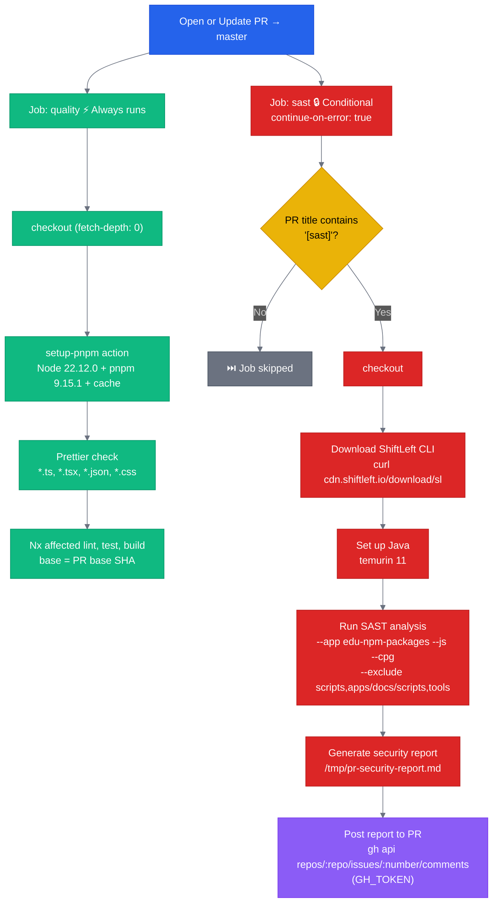
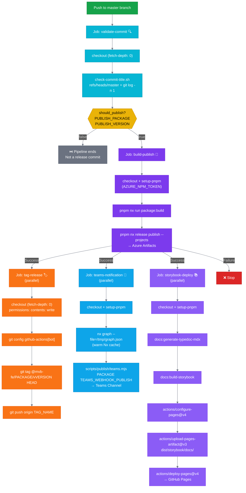
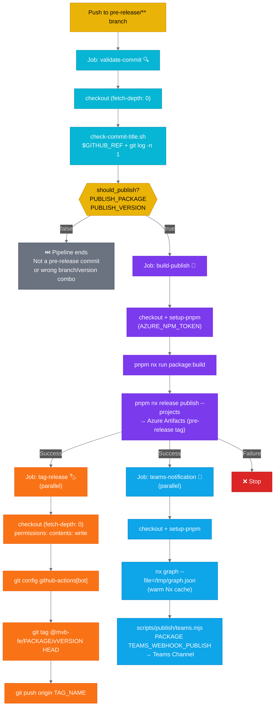

# GitHub Actions Workflow Diagrams

## PR Quality Checks (`pr.yml`)

---

## Release Workflow (`release.yml`)

---

## Pre-release Workflow (`prerelease.yml`)

---

## Scheduled Security Scan (`security-scan.yml`)

```mermaid
%%{init: {"theme": "dark", "themeVariables": {"primaryColor": "#4a5568", "primaryTextColor": "#ffffff", "primaryBorderColor": "#2d3748", "lineColor": "#6b7280"}}}%%
flowchart TD
    A["Weekly: Monday 10:00 AM UTC+8\nor workflow_dispatch"] --> B["Job: sast-scan 🔒"]

    B --> B1["checkout"]
    B1 --> B2["Download ShiftLeft CLI\ncurl cdn.shiftleft.io/download/sl"]
    B2 --> B2J["Set up Java\ntemurin 11"]
    B2J --> B3["Extract branch name\n$GITHUB_REF → branch output"]
    B3 --> B4["Run SAST analysis\n--app edu-npm-packages --tag branch=BRANCH\n--exclude scripts,apps/docs/scripts,tools"]
    B4 --> B5["Generate report\n/tmp/monthly-security-report.md"]
    B5 --> B6["Upload artifact\nname: SecurityReport"]

    B6 --> C["Job: notify 📣"]

    C --> C1["checkout + download artifact\nSecurityReport → /tmp"]
    C1 --> C2["setup-pnpm\n(AZURE_NPM_TOKEN)"]
    C2 --> C3["Analyze report, create issue if needed,\nand send Teams notification"]

    C3 --> C4{"Critical count > 0?"}
    C4 -->|"No"| C5["✅ No critical issues\nSkip issue creation"]
    C4 -->|"Yes"| C6["gh issue create\n--label security\n→ GitHub Issue"]

    C5 --> C7[".github/scripts/teams.mjs\nWEBHOOK CRITICAL_COUNT ISSUE_NUMBER\n→ Teams Channel (TEAMS_WEBHOOK_SECURITY)"]
    C6 --> C7

    style A fill:#f59e0b,stroke:#d97706,color:#000000
    style B fill:#dc2626,stroke:#b91c1c,color:#ffffff
    style B1 fill:#dc2626,stroke:#b91c1c,color:#ffffff
    style B2 fill:#dc2626,stroke:#b91c1c,color:#ffffff
    style B2J fill:#dc2626,stroke:#b91c1c,color:#ffffff
    style B3 fill:#dc2626,stroke:#b91c1c,color:#ffffff
    style B4 fill:#dc2626,stroke:#b91c1c,color:#ffffff
    style B5 fill:#dc2626,stroke:#b91c1c,color:#ffffff
    style B6 fill:#8b5cf6,stroke:#7c3aed,color:#ffffff
    style C fill:#06b6d4,stroke:#0891b2,color:#ffffff
    style C1 fill:#06b6d4,stroke:#0891b2,color:#ffffff
    style C2 fill:#10b981,stroke:#059669,color:#ffffff
    style C3 fill:#f59e0b,stroke:#d97706,color:#000000
    style C4 fill:#eab308,stroke:#ca8a04,color:#000000
    style C5 fill:#6b7280,stroke:#4b5563,color:#ffffff
    style C6 fill:#ef4444,stroke:#dc2626,color:#ffffff
    style C7 fill:#0ea5e9,stroke:#0284c7,color:#ffffff
```

---

## setup-pnpm Composite Action

```mermaid
%%{init: {"theme": "dark", "themeVariables": {"primaryColor": "#4a5568", "primaryTextColor": "#ffffff", "primaryBorderColor": "#2d3748", "lineColor": "#6b7280"}}}%%
flowchart LR
    A["Job sets\nAZURE_NPM_TOKEN env"] --> B["actions/setup-node@v4\nNode 22.12.0"]
    B --> C["pnpm/action-setup@v4\npnpm 9.15.1"]
    C --> D["Get pnpm store path"]
    D --> E["actions/cache@v4\n~/.pnpm-store\nkey: pnpm-OS-hash(pnpm-lock.yaml)"]
    E --> F["pnpm i --frozen-lockfile\n(reads .npmrc → Azure Artifacts)"]

    style A fill:#4a5568,stroke:#2d3748,color:#ffffff
    style B fill:#10b981,stroke:#059669,color:#ffffff
    style C fill:#10b981,stroke:#059669,color:#ffffff
    style D fill:#10b981,stroke:#059669,color:#ffffff
    style E fill:#10b981,stroke:#059669,color:#ffffff
    style F fill:#16a34a,stroke:#15803d,color:#ffffff
```

